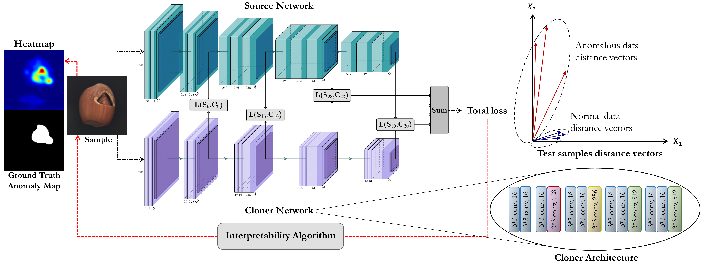

# Multiresolution Knowledge Distillation for Anomaly Detection

This repository contains code for training and evaluating the proposed method in our paper [Multiresolution Knowledge Distillation for Anomaly Detection].



### 1- Clone this repo:
``` bash
git clone https://github.com/Niousha12/Knowledge_Distillation_AD.git
cd Knowledge_Distillation_AD
```
### 2- Datsets:
This repository performs Novelty/Anomaly Detection in the following datasets: MNIST, Fashion-MNIST, CIFAR-10, MVTecAD, and 2 medical datasets (Head CT hemorrhage and Brain MRI Images for Brain Tumor Detection).

Furthermore, Anomaly Localization have been performed on MVTecAD dataset.

MNIST, Fashion-MNIST and CIFAR-10 datasets will be downloaded by Torchvision. You have to download [MVTec AD](https://www.mvtec.com/company/research/datasets/mvtec-ad/), [Head CT hemorrhage](http://www.kaggle.com/felipekitamura/head-ct-hemorrhage), and [Brain MRI Images for Brain Tumor Detection](http://www.kaggle.com/navoneel/brain-mri-images-for-brain-tumor-detection), and unpack them into the `Dataset` folder.


### 3- Train the Model:
Start the training using the following command. The checkpoints will be saved in the folder `outputs/{dataset_name}/{normal_class}/checkpoints`.

Train parameters such as dataset_name, normal_class, batch_size and etc. can be specified in `configs/config_train.yaml`.
``` bash
python train.py --config configs/config_train.yaml
```

### 4- Test the Trained Model:
Test parameters can be specified in `configs/config_test.yaml`.
``` bash
python test.py --config configs/config_test.yaml
```
